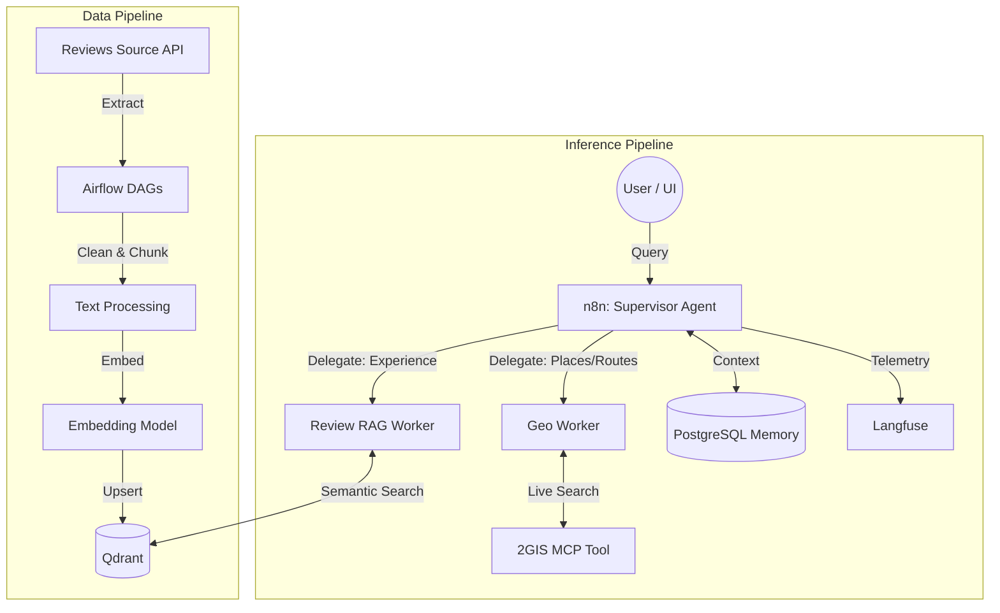

# 🌍 AI Travel Concierge (Production-Ready Architecture)


Производственный прототип интеллектуального travel-ассистента, демонстрирующий современные паттерны проектирования AI-систем: **Multi-Agent Orchestration (Supervisor/Worker)**, **Agentic RAG** и **Dual-Loop Architecture** (разделение Data Pipeline и Inference).

---

## 📌 Бизнес-проблема и Ценность (Value Proposition)
Большинство существующих LLM-ассистентов дают общие, неактуальные советы (галлюцинируют) или ограничены статичным контекстом. 
Данный проект решает эту проблему путем гибридного подхода:
1. **Live-данные (Geo)**: Ассистент строит маршруты и ищет места в реальном времени через MCP-интеграцию с API 2GIS.
2. **Grounding (RAG)**: Рекомендации строятся не на базовых знаниях LLM, а на семантическом поиске по свежей базе реальных пользовательских отзывов.
3. **Надежность и Масштабируемость**: Тяжелые процессы (ETL, векторизация) вынесены в асинхронные батч-джобы (Apache Airflow), оставляя агентский слой (n8n) быстрым и отзывчивым.

---

## 🏗 Архитектура (Dual-Loop System)

Архитектура разделена на два независимых контура для обеспечения отказоустойчивости и низкого latency:

### 1. Data Pipeline (Ingestion & Enrichment)
- **Оркестратор**: Apache Airflow
- **Стек**: Python, OpenAI Embeddings / BGE-m3, Qdrant
- **Логика**: Ежедневные DAG-и забирают новые отзывы из внешних источников, нормализуют текст, бьют на чанки (Chunking), генерируют эмбеддинги и делают upsert в векторную БД Qdrant с обогащением метаданными.

### 2. Inference Pipeline (Multi-Agent Routing)
- **Оркестратор**: n8n
- **Стек**: GPT-4o, Langfuse, PostgreSQL, Redis
- **Логика**: Запрос пользователя обрабатывается Supervisor-агентом, который делегирует задачи специализированным Worker-агентам (Geo Worker для карт, RAG Worker для аналитики отзывов).

### Архитектурная схема


---

## 🛠 Технологический стек

* **Оркестрация AI**: n8n (Advanced AI nodes, Sub-workflows)
* **Оркестрация Данных**: Apache Airflow 2.x
* **Векторная БД**: Qdrant
* **LLM & Embeddings**: OpenAI API (GPT-4o, text-embedding-3-small) / vLLM (опционально)
* **Observability (LLMOps)**: Langfuse (Prompt management, tracing, token metrics)
* **Хранилище контекста**: PostgreSQL (Session persistence)
* **Инфраструктура**: Docker Compose

---

## 📂 Структура репозитория

```text
.
├── airflow_dags/               # DAGs для извлечения данных и RAG-пайплайна
│   ├── dag_2gis_reviews.py     # ETL: парсинг -> эмбеддинги -> Qdrant
│   └── plugins/
├── n8n_workflows/              # Экспортированные JSON воркфлоу агентов
│   ├── 01_supervisor.json      # Главный маршрутизатор (ReAct)
│   ├── 02_geo_worker.json      # Агент для работы с 2GIS MCP
│   └── 03_rag_worker.json      # Агент для семантического поиска
├── infrastructure/             # Развертывание
│   ├── docker-compose.yml      # Полный стек (n8n, Airflow, Postgres, Qdrant)
│   ├── init.sql                # Миграции БД
│   └── .env.example
├── docs/                       # Схемы и документация
└── README.md
```

---

## 🚀 Быстрый старт (Локальный запуск)

1. **Клонируйте репозиторий**:
   ```bash
   git clone https://github.com/yourusername/ai-travel-concierge.git
   cd ai-travel-concierge/infrastructure
   ```

2. **Настройте переменные окружения**:
   Скопируйте `.env.example` в `.env` и добавьте ключи:
   ```bash
   OPENAI_API_KEY=sk-...
   LANGFUSE_PUBLIC_KEY=pk-lf-...
   LANGFUSE_SECRET_KEY=sk-lf-...
   QDRANT_API_KEY=...
   ```

3. **Запустите инфраструктуру**:
   ```bash
   docker-compose up -d
   ```
   * *n8n будет доступен по адресу:* `http://localhost:5678`
   * *Airflow webserver:* `http://localhost:8080`
   * *Qdrant dashboard:* `http://localhost:6333`

4. **Импортируйте воркфлоу**:
   * Откройте UI n8n, перейдите в Workflows -> Import from File.
   * Загрузите файлы из папки `n8n_workflows/`.

5. **Инициализируйте данные**:
   * Перейдите в Airflow и запустите DAG `dag_2gis_reviews` для наполнения базы Qdrant тестовыми отзывами.

---

## 📊 Мониторинг и Observability (LLMOps)
Проект интегрирован с **Langfuse** для обеспечения прозрачности AI-процессов.
Каждый шаг агента (Tool Call, Retrieval, Generation) трассируется, что позволяет:
- Отслеживать Latency (Time to First Token).
- Контролировать Cost/Token usage.
- Оценивать релевантность извлеченных из Qdrant чанков (Retrieval Evaluation).

---
*Разработано как демонстрация компетенций Senior AI Architect / AI Engineer.*
